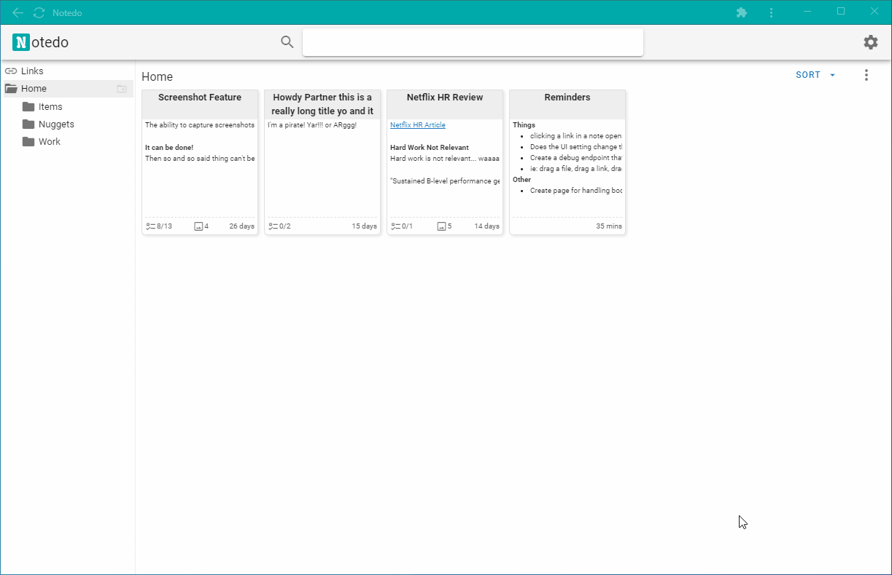

# Notedo


- Keep your Notes, Todos, Images, and Links accessible
- Fast full text search with instant indexing
- Vim mode (because Vim > Emacs)
- [Progressive Web App (PWA)](https://developer.mozilla.org/en-US/docs/Web/Progressive_web_apps) compatible for a native experience
- All connections stay local with zero external dependencies
- Works equally on Linux, Mac, and Windows
- Distributed as a portable self contained executable (no install required)
- and more... **_under active development_**

## Usage
Download the [latest release](https://github.com/elnook/notedo/releases/tag/0.1.5-26-g3b9ecf9) and launch the server

```
notedo server --gui
```

Contextual help is available by running `notedo help`

## Config
Settings can be overridden by CLI flags, environment variables, and the config file (in that order)

e.g. to launch with a different host and port:

```
notedo server --host 0.0.0.0 -p 8080
```

The flag names resemble the equivalent environment variable and config file settings

For example, 
```
$ notedo help
...
Flags:
  -d, --datadir string     Data storage path ...
...
```
To override datadir you can set the environment variable `NOTEDO_DATADIR=<something>` or in the `notedo.yaml`:
```yaml
datadir: <something>
```
See the contextual help for additional instructions on modifying settings

## Tips
- `Ctrl+P` (`Command+P`) to focus search field
- `Ctrl+Shift+L` (`Command+Shift+L`) to focus search field in `link` mode
- Search supports `slash commands`, start search with `/`
- Search queries use Bleve's [Query String Syntax](http://blevesearch.com/docs/Query-String-Query/), few examples:
  - `note` will find instances of `note`, `Note`, `notes`, `Notes`, etc.
  - `note*` will find the same but also non-stemmed words, such as `Notedo`
- Use the bookmarklet for quickly saving links